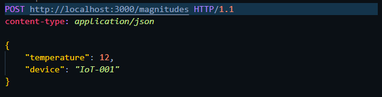
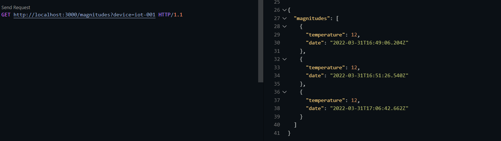
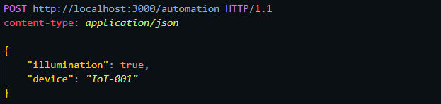

# My first IoT App with Flutter

Mi primera aplicación IoT con Flutter - Ejemplo Conferencia.

## **API**

API REST desarrollada en NodeJS con Express como punto de comunicacion entre dispositivo IoT y un cliente (Frontend) para el consumo de datos.

### **Endpoints**

- ### Registro de magnitudes: */magnitudes*
  

- ### Obtener magnitudes: */magnitudes?device=###*
  

- ### Registro de automatizacion: */automation*
  

- ### Obtener automatizacion: */automation?device=###*
  

